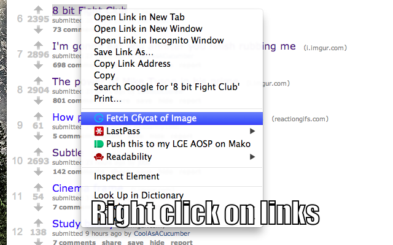
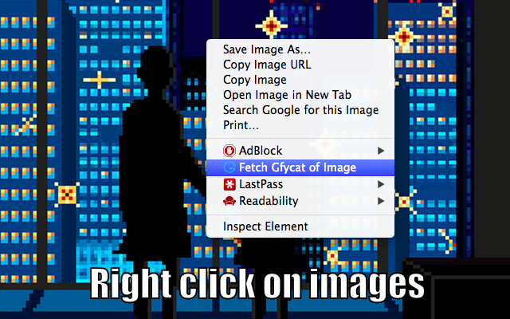

GfyFetcher
==========

A simple Chrome extension that adds a context menu item for opening gifs as HTML5 videos via [Gfycat.com](http://gfycat.com/).

## Chrome Store Install

Install from [here](https://chrome.google.com/webstore/detail/gfyfetcher/logiomopdooakjpclhgkgcfoegmecfge) and stay up to date!

## Local Install

Navigate to *chrome://extensions*, enable *Developer mode*, and click "Load unpacked extension...".